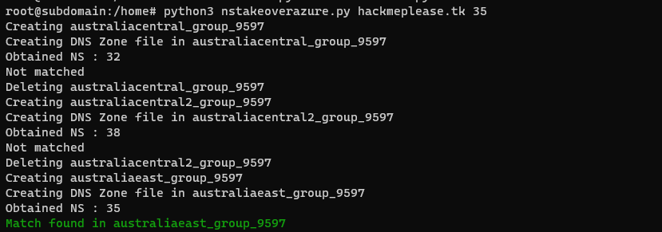

# NS Takeover - Azure

Takeover domains vulnerable to Name Server takeover pointing to Azure DNS.


## Prerequisites

- [Azure CLI](https://learn.microsoft.com/en-us/cli/azure/install-azure-cli)
  `pip3 install azure-cli==2.4.0`
- Python3

## Usage:
```bash
$ python3 nstakeoverazure.py <domain> <nameserver number>
```

Consider the domain `hackmeplease.tk` as vulnerable having `SERVFAIL` status when resolving and it's nameservers are:

```
hackmeplease.tk.            5       IN      NS      ns1-35.azure-dns.com.
hackmeplease.tk.            5       IN      NS      ns2-35.azure-dns.net.
hackmeplease.tk.            5       IN      NS      ns3-35.azure-dns.org.
hackmeplease.tk.            5       IN      NS      ns4-35.azure-dns.info.
```
Note: To find nameservers of `SERVFAIL` status domain/subdomain, use command `dig +trace hackmeplease.tk`

```bash
$ python3 nstakeoverazure.py hackmeplease.tk 35
```


