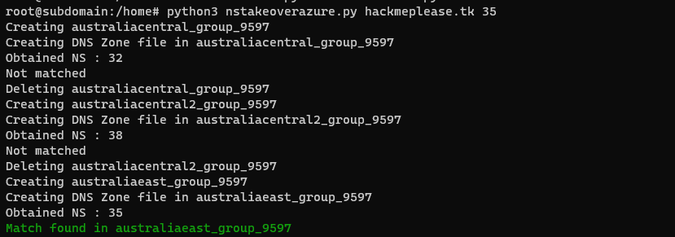

# NS Takeover - Azure

Azure DNS nameserver allocation matcher for authorized takeover validation.

Only use this against domains you own or are explicitly authorized to assess.

## What It Does

The tool detects the Azure DNS nameserver number delegated for a domain, then
creates temporary Azure DNS zones across available regions until Azure assigns a
matching nameserver set. Non-matching resource groups are deleted. When a match
is found, the claimed resource group and DNS zone are kept for evidence.

## Prerequisites

- Python 3.9+
- [Azure CLI](https://learn.microsoft.com/en-us/cli/azure/install-azure-cli)
- An authenticated Azure CLI session with an active subscription:

```bash
az login
az account show
```

## Install

Run directly from the checkout:

```bash
python3 nstakeoverazure.py <domain>
```

Or install the local CLI in editable mode:

```bash
python3 -m pip install -e .
nstakeover <domain>
```

The module entrypoint is also available:

```bash
python3 -m nstakeover <domain>
```

## Usage

```bash
python3 nstakeoverazure.py <domain>
```

Example delegated nameservers:

```text
hackmeplease.tk. 5 IN NS ns1-35.azure-dns.com.
hackmeplease.tk. 5 IN NS ns2-35.azure-dns.net.
hackmeplease.tk. 5 IN NS ns3-35.azure-dns.org.
hackmeplease.tk. 5 IN NS ns4-35.azure-dns.info.
```

Run:

```bash
python3 nstakeoverazure.py hackmeplease.tk
```

## Options

```bash
python3 nstakeoverazure.py <domain> --detect-only
python3 nstakeoverazure.py <domain> --ns 35
python3 nstakeoverazure.py <domain> --regions eastus,westeurope
```

- `--detect-only`: auto-detect the Azure nameserver number without creating Azure resources.
- `--ns`: manually provide one or more Azure nameserver numbers if auto-detection fails.
- `--regions`: limit Azure locations to try.

Auto-detection first uses `dig` when available, then falls back to Google
DNS-over-HTTPS.

## Project Layout

```text
.
├── nstakeoverazure.py       # Backward-compatible script entrypoint
├── nstakeover/
│   ├── __main__.py          # python -m nstakeover entrypoint
│   ├── azure.py             # Azure CLI/provider/resource operations
│   ├── cli.py               # Argument parsing and workflow orchestration
│   ├── commands.py          # Subprocess wrapper
│   ├── dns.py               # DNS parsing and auto-detection
│   └── output.py            # Console output helpers
├── static/                  # README assets
├── pyproject.toml           # Package metadata and CLI scripts
└── .gitignore
```

## Development

Run checks:

```bash
python3 -m py_compile nstakeoverazure.py nstakeover/*.py
python3 nstakeoverazure.py --help
python3 -m nstakeover --help
```

Safe DNS-only smoke test:

```bash
python3 nstakeoverazure.py <domain> --detect-only
```

## Screenshot


